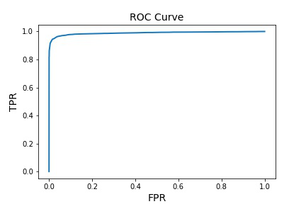
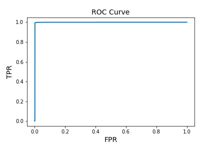
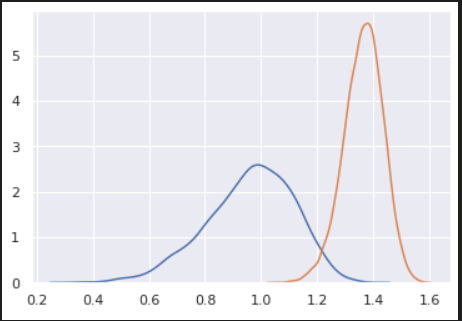

# InsightFace_Pytorch

Pytorch0.4.1 codes for InsightFace

------

## 1. Intro

- This repo is a reimplementation of Arcface[(paper)](https://arxiv.org/abs/1801.07698), or Insightface[(github)](https://github.com/deepinsight/insightface)
- For models, including the pytorch implementation of the backbone modules of Arcface and MobileFacenet
- Codes for transform MXNET data records in Insightface[(github)](https://github.com/deepinsight/insightface) to Image Datafolders are provided
- Pretrained models are posted, include the [MobileFacenet](https://arxiv.org/abs/1804.07573) and IR-SE50 in the original paper

------

## 2. Pretrained Models & Performance

[IR-SE50 @ BaiduNetdisk](https://pan.baidu.com/s/12BUjjwy1uUTEF9HCx5qvoQ), [IR-SE50 @ Onedrive](https://1drv.ms/u/s!AhMqVPD44cDOhkPsOU2S_HFpY9dC)

| LFW(%) | CFP-FF(%) | CFP-FP(%) | AgeDB-30(%) | calfw(%) | cplfw(%) | vgg2_fp(%) |
| ------ | --------- | --------- | ----------- | -------- | -------- | ---------- |
| 0.9952 | 0.9962    | 0.9504    | 0.9622      | 0.9557   | 0.9107   | 0.9386     |

[Mobilefacenet @ BaiduNetDisk](https://pan.baidu.com/s/1hqNNkcAjQOSxUjofboN6qg), [Mobilefacenet @ OneDrive](https://1drv.ms/u/s!AhMqVPD44cDOhkSMHodSH4rhfb5u)

| LFW(%) | CFP-FF(%) | CFP-FP(%) | AgeDB-30(%) | calfw(%) | cplfw(%) | vgg2_fp(%) |
| ------ | --------- | --------- | ----------- | -------- | -------- | ---------- |
| 0.9918 | 0.9891    | 0.8986    | 0.9347      | 0.9402   | 0.866    | 0.9100     |

## 3. How to use

- clone

  ```
  git clone https://github.com/TropComplique/mtcnn-pytorch.git
  ```

### 3.1 Data Preparation

#### 3.1.1 Prepare Facebank (For testing over camera or video)

Provide the face images your want to detect in the data/face_bank folder, and guarantee it have a structure like following:

```
Dataset/
        ---> Người(>7 tuổi)/
            ---> Nguyen Van A
                ---> Ảnh 1.jpg
                ---> Ảnh 2.jpg
                    ...
            ---> Nguyen Van B
                ---> Ảnh 1.jpg
                ---> Ảnh 2.jpg
                    ---
            ............
        ---> Trẻ con(<=7 tuổi)/
            ---> Tran thi H
                ---> Ảnh 1.jpg
                ---> Ảnh 2.jpg
                    ...
            ---> Nguyen Thu T
                ---> Ảnh 1.jpg
                ---> Ảnh 2.jpg
                    ---
            ............
``` 

#### 3.1.2 download the pretrained model to work_space/model

If more than 1 image appears in one folder, an average embedding will be calculated

#### 3.2.3 Prepare Dataset ( For training)

download the refined dataset: (emore recommended)

- [emore dataset @ BaiduDrive](https://pan.baidu.com/s/1eXohwNBHbbKXh5KHyItVhQ), [emore dataset @ Dropbox](https://www.dropbox.com/s/wpx6tqjf0y5mf6r/faces_ms1m-refine-v2_112x112.zip?dl=0)
- More Dataset please refer to the [original post](https://github.com/deepinsight/insightface/wiki/Dataset-Zoo)

**Note:** If you use the refined [MS1M](https://arxiv.org/abs/1607.08221) dataset and the cropped [VGG2](https://arxiv.org/abs/1710.08092) dataset, please cite the original papers.

- after unzip the files to 'data' path, run :

  ```
  python prepare_data.py
  ```

  after the execution, you should find following structure:

```
faces_emore/
            ---> agedb_30
            ---> calfw
            ---> cfp_ff
            --->  cfp_fp
            ---> cfp_fp
            ---> cplfw
            --->imgs
            ---> lfw
            ---> vgg2_fp
```

------

### 3.2 detect over camera:

- 1. download the desired weights to model folder:

- [IR-SE50 @ BaiduNetdisk](https://pan.baidu.com/s/12BUjjwy1uUTEF9HCx5qvoQ)
- [IR-SE50 @ Onedrive](https://1drv.ms/u/s!AhMqVPD44cDOhkPsOU2S_HFpY9dC)
- [Mobilefacenet @ BaiduNetDisk](https://pan.baidu.com/s/1hqNNkcAjQOSxUjofboN6qg)
- [Mobilefacenet @ OneDrive](https://1drv.ms/u/s!AhMqVPD44cDOhkSMHodSH4rhfb5u)

- 2 to take a picture, run

  ```
  python take_pic.py -n name
  ```

  press q to take a picture, it will only capture 1 highest possibility face if more than 1 person appear in the camera

- 3 or you can put any preexisting photo into the facebank directory, the file structure is as following:

```
- facebank/
         name1/
             photo1.jpg
             photo2.jpg
             ...
         name2/
             photo1.jpg
             photo2.jpg
             ...
         .....
    if more than 1 image appears in the directory, average embedding will be calculated
```

- 4 to start

  ```
  python face_verify.py 
  ```

- - -

### 3.3 detect over video:

```
​```
python infer_on_video.py -f [video file name] -s [save file name]
​```
```

the video file should be inside the data/face_bank folder

- Video Detection Demo [@Youtube](https://www.youtube.com/watch?v=6r9RCRmxtHE)

### 3.4 Training:

```
​```
python train.py -b [batch_size] -lr [learning rate] -e [epochs]

# python train.py -net mobilefacenet -b 200 -w 4
​```
```

## 4. References 

- This repo is mainly inspired by [deepinsight/insightface](https://github.com/deepinsight/insightface) and [InsightFace_TF](https://github.com/auroua/InsightFace_TF)

## PS

- PRs are welcome, in case that I don't have the resource to train some large models like the 100 and 151 layers model
- Email : treb1en@qq.com


# Report

## 1. Dataset (linhnv)
- Training datasets:

  | [DeepGlint](https://www.dropbox.com/s/4x39o2x40rewl5l/faces_glint.zip?dl=0)  | Ailab    | CelebA    |
  | ---------- | -------- | --------- |
  | 6.75M imgs | 50k imgs | 200k imgs |
  | 181k ids   | 50k ids  | 10k ids   |
  Another dataset can be download [here](https://github.com/deepinsight/insightface/wiki/Dataset-Zoo)
- Validate datasets:


### 1.1. Preprocess
- Tất cả ảnh training được lưu theo cấu trúc chung như sau:
```
Ailab_prepocessed
│   faces_ailab_labels.pickle    
│
└───train
│   │   faces_ailab_112x112.pickle
│   │
│   └───id_1
│       │   img_1.jpg
│       │   img_2.jpg
│       │   ...
│   
└───val
|   │   faces_ailab_112x112_inter.pickle
|   │   faces_ailab_112x112_intra.pickle
│   └───id_n
│       │   img_1.jpg
│       │   img_2.jpg
│       │   ...
```

### 1.2. Description and visualization (amount, ratio intra/inter)

### 1.3. Generate intra inter class

## 2. Models (hoang)

## 3. Experiments

### 3.1. Setup environment ###

### 3.2. Training
*3.2.1 Chuẩn bị dữ liệu*

**DeepGlint dataset:**
- 1: [Download DeepGlint dataset.](https://www.dropbox.com/s/4x39o2x40rewl5l/faces_glint.zip?dl=0)
- 2: Extract and run following code: 
```
python one_hit_prepare.py -r "path/to/deepGlint_extracted"
```  
> **NOTE**: Dữ liệu validate được tự động giải nén và lưu khi giải nén DeepGlint dataset theo dòng code 22 trong on_hit_prepare.py.

**Ailab dataset:**

Tất cả ảnh sẽ được chạy qua MTCNN và align để loại bỏ các ảnh quá xấu, bị nhiễu nặng hoặc không bao gồm mặt người. Sau đó ảnh sẽ được lưu lại với kịch thước 112x112. Do dữ liệu Ailab dataset chỉ có 1 mặt tương ứng mỗi người (id) do đó intra_pairs sẽ được tạo bằng cách biến đổi ảnh gốc với các phép biến đổi ảnh được class ImageDataGenerator của Keras cung cấp. Các cặp intra_pairs được tạo bằng 2 ảnh bất kỳ trong cùng một thư mục id, các cặp inter_pairs được tạo bằng 2 ảnh gốc chưa qua biến đổi.
- 1. Giải nén dữ liệu.
- 2. Chạy lệnh sau để tạo inter_pairs và intra_pairs:
```
python preprocess_ailab_img.py
```
> **NOTE**: Chú ý thay đúng đường dẫn đến thư mục từ dòng 109 đến 115

**CelebA:**

*3.2.2 Training*

### 3.3. Post-processing

### 3.4. Evaluate
<br />

>Download pretrained model:
>- [Resnet50](https://onedrive.live.com/?authkey=%21AOw5TZL8cWlj10I&cid=CEC0E1F8F0542A13&id=CEC0E1F8F0542A13%21835&parId=root&action=defaultclick)
>- [MobileNet](https://onedrive.live.com/?cid=cec0e1f8f0542a13&id=CEC0E1F8F0542A13%21836&authkey=!AIweh1IfiuF9vm4)

<br /><br />

### **Evaluate dataset with pre-trained model resnet50/mobilenet + ArcFace ( accuracy + best thresh hold)**  
****
|           Dataset           | resnet50 + ArcFace | mobilenet + ArcFace |
| :-------------------------: | :----------------: | :-----------------: |
| AgeDB-30 (570 ids/12K imgs) |    96.43 / 1.52    |    93.47 / 1.62     |
|  CALFW (5749 ids/13K imgs)  |    95.57 / 1.50    |    94.02 / 1.53     |
|           CFP-FF            |    99.63 / 1.45    |     98.91 / 1.5     |
|  CFP-FP (500 ids/7K imgs)   |    95.04 / 1.64    |    89.86 / 1.72     |
|  CPLFW (5749 ids/13K imgs)  |    91.07 / 1.59    |     86.6 / 1.67     |
|   LFW (5749 ids/13K iags)   |    99.37 / 1.43    |    99.18 / 1.521    |
| VGG2_FP (9K ids/3.3M imgs)  |    93.92 / 1.65    |    91.01 / 1.75     |

<br /><br /><br />

### **ROC Curve graph of evaluate dataset**
****
|                                       |                                 |
| :-----------------------------------: | :-----------------------------: |
|  |  |
|               AgeDB-30                |              CALFW              |

<br />

|                                   |                                   |
| :-------------------------------: | :-------------------------------: |
|  |  |
|              CFP-FF               |              CFP-FP               |
<br />

|                             |                                     |
| :-------------------------: | :---------------------------------: |
|  |  |
|             LFW             |               VGG2_FP               |

<br /><br /><br />

### **Evaluate their pre-trained models with our datasets**
****
> Our sample dataset structure:
> - each identity has a image.
> - inter: 10K pairs 
> - intra: 10K pairs simple generated, augmented images from original data ( rotate, width shift, height shift, horizontal flip, ...)

|           inter distance graph            |           ROC Curve            |
| :---------------------------------------: | :----------------------------: |
|  |  |
|           best threshold: ~1.22           |                                |


>**Comment**:
>- Some images can not be detected.
>- Discriminative power in inter is not enough: threshold ~ 1.22 while threshold in lwf, agedb, cfp is in [1.43, 1.65]. 
>- Data augmentation is simple.
>- Don't have pre-train model resnet100 (resnet100 is best model in ArcFace paper)


two pre-trained models:

- Student model(simple)
- Teacher model(deeper): freeze backbone
  
$l_s, l_t$: output classifier logits
$f_s, f_t$: features


